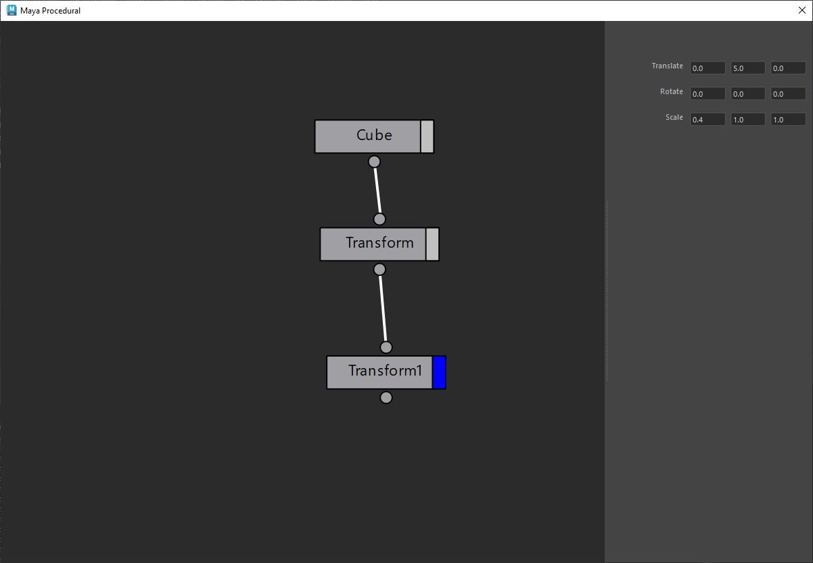

# Procedural Maya (WIP)

I wanted to create a procedural modeling window, similar to Houdini, inside Maya.

## Interface

You can zoom-in/out and move in the scene using the middle mouse and wheel button.
You can open a dropdown of all the available nodes by right-clicking on the scene.

You can link nodes and delete a connection by left-clicking on it.

For now, all the available nodes are working:
- Cube
- Transform

I will continue to add more nodes to the list.

